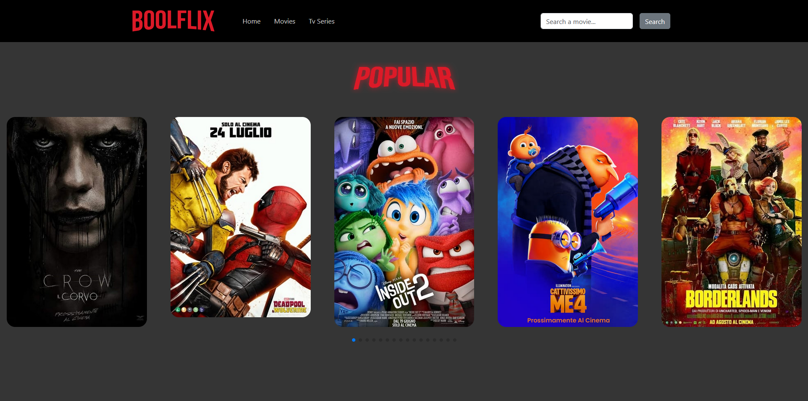

# BoolFlix - Movie and TV Series App

BoolFlix è un'applicazione web che consente agli utenti di visualizzare una lista di film popolari e cercare film o serie TV. Questo progetto è stato sviluppato utilizzando Vue.js per la gestione dell'interfaccia utente e Axios per recuperare i dati da un'API esterna.



## Funzionalità principali

- **Visualizzazione film popolari**: All'avvio dell'applicazione, gli utenti vedono un elenco di film popolari recuperati dall'API.
- **Funzione di ricerca**: Gli utenti possono cercare specifici film o serie TV inserendo un titolo nel campo di ricerca.
- **Interfaccia dinamica**: L'interfaccia mostra solo i film popolari all'avvio e nasconde le sezioni di "Movies" e "TV Series". Queste sezioni appaiono solo dopo che l'utente effettua una ricerca.
- **Responsive Design**: Il layout si adatta a diverse dimensioni di schermo per offrire una migliore esperienza utente sia su desktop che su dispositivi mobili.
- **Immagini dinamiche**: A seconda della sezione (film o serie TV), vengono visualizzate immagini e titoli diversi.

## Struttura del progetto

Il progetto è suddiviso nei seguenti componenti principali:

- **Header.vue**: Contiene il logo dell'applicazione e il campo di ricerca. L'utente può digitare un titolo e fare clic su "Search" per avviare la ricerca.
- **Main.vue**: Mostra una lista di film o serie TV a seconda del tipo selezionato (film o TV). Questo componente riceve i dati attraverso le props.
- **Popular.vue**: Visualizza la lista dei film popolari al caricamento iniziale dell'applicazione.
- **Card.vue**: Componente che rappresenta una singola card di un film o di una serie TV, con dettagli come titolo, immagine e descrizione.

## Tecnologie utilizzate

- **Vue.js**: Framework JavaScript progressivo per la costruzione dell'interfaccia utente.
- **Axios**: Libreria per effettuare richieste HTTP per il recupero dei dati dall'API esterna.
- **SCSS**: Utilizzato per stilizzare l'applicazione e rendere il design responsive.
- **API esterna**: I dati dei film e delle serie TV sono recuperati tramite chiamate a un'API di terze parti (ad esempio, TMDB).

## Setup del progetto

### Prerequisiti

Assicurati di avere installato Node.js e npm.

### Installazione

1. Clona il repository:

   ```bash
   git clone https://github.com/tuo-username/boolflix.git
   cd boolflix
   ```

2. Clona il repository:

   ```bash
   npm install
   ```

3. Clona il repository:

   ```bash
   VUE_APP_API_KEY=la-tua-api-key
   ```

### Avvio dell'applicazione

Per eseguire il progetto in modalità di sviluppo:

```bash
npm run serve
```

### Esempi di utilizzo

    All'avvio dell'app, viene visualizzata la sezione "Popular" che mostra una lista dei film più popolari.
    Quando l'utente utilizza il campo di ricerca, le sezioni "Movies" e "TV Series" vengono caricate con i risultati corrispondenti.

### Personalizzazione

Puoi modificare facilmente l'aspetto grafico cambiando le immagini delle sezioni, ad esempio sostituendo i file film2.png e tvseries.png con immagini personalizzate nella cartella assets/img/.
